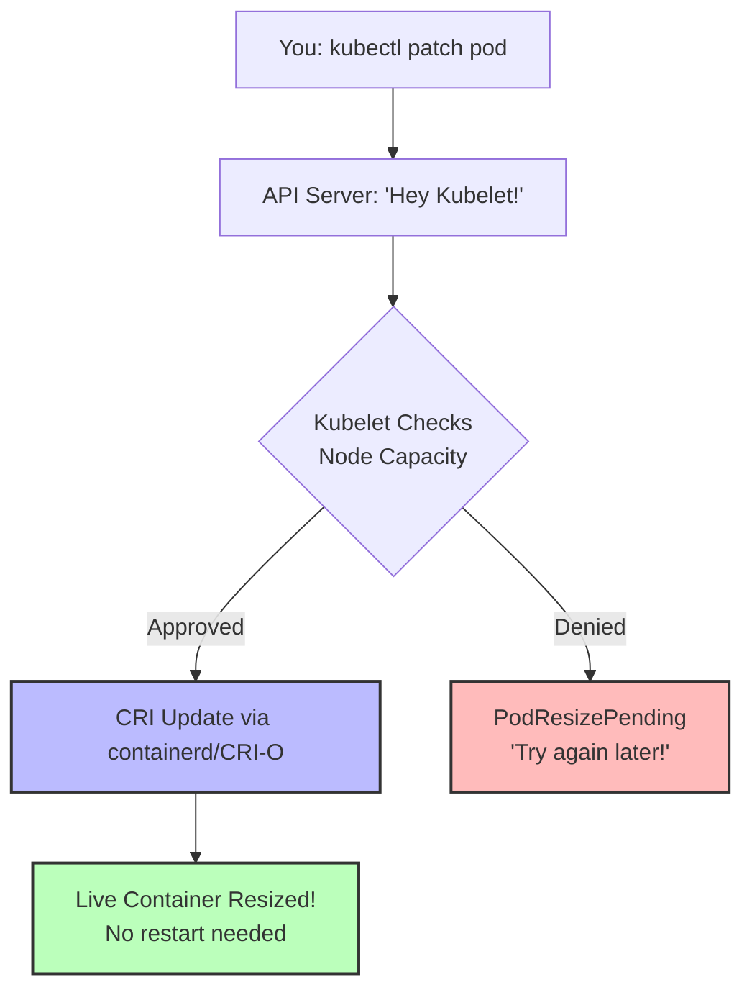
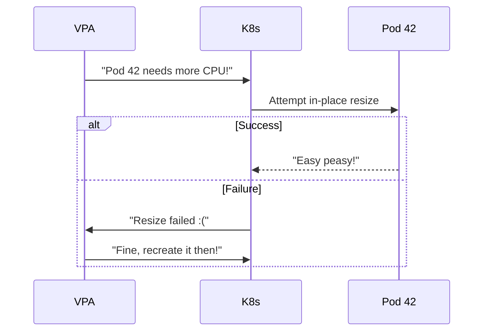

Remember that feeling? You meticulously configured your Kubernetes pods, set the CPU and memory just right (or so you thought), only to have your application start gasping for air or hogging resources like it's Black Friday for RAM. In the old days, the only cure was a full pod restart – a disruptive event that often felt like performing open-heart surgery with a butter knife while your SRE team watched through the Operating Room window.

Well, good news, fellow Kubernetes wranglers! Version 1.33 has landed, and it brings with it a feature that many of us have been dreaming about: **[in-place pod vertical scaling](https://kubernetes.io/docs/tasks/configure-pod-container/resize-container-resources/)**! Yes, you read that right. You can now adjust the CPU and memory of your running pods without the dreaded restart. *Cue the confetti cannons and slightly-too-enthusiastic DevOps high-fives!*

**This is now a beta feature in Kubernetes 1.33 and enabled by default!** You no longer need to enable feature gates to use it, making it much more accessible for production workloads ([Kubernetes docs confirm](https://kubernetes.io/docs/tasks/configure-pod-container/resize-container-resources/)).

This is particularly exciting if you, like me, have been pondering the nuances of [vertical pod autoscaling](https://www.linkedin.com/pulse/vpa-kubernetes-autoscaler-could-doesnt-yet-alexei-ledenev-dkrbf). While VPA is fantastic in theory, its current "recreate" mode can be a bit… dramatic. In-place resize offers a more graceful way to adjust resources, potentially paving the way for a smoother VPA experience down the line.

---

## Why This Feature is Bigger Than My Morning Coffee ☕

For us Kubernetes folks, this feature is a game-changer. Imagine a scenario where your application suddenly experiences a surge in traffic. Previously, you'd either have to over-provision (costly!) or trigger a VPA update that would bounce your pods. Now, you can simply nudge the CPU and memory upwards on the fly, keeping your application happy and your users even happier.

Think about stateful applications, databases, or those applications that benefit from continuous availability. In-place resize can minimize downtime and provide a much more seamless scaling experience. Let's break down why:

1. **No More Pod Restart Roulette**
   Previously, adjusting resources meant playing Russian roulette with your uptime. The [Vertical Pod Autoscaler (VPA)](https://kubernetes.io/docs/concepts/workloads/autoscaling/) would terminate pods like an overzealous bouncer at closing time. Now? We can resize resources smoother than a barista crafting latte art.

2. **Cost Optimization Magic**
   Over-provisioning "just in case" becomes less necessary. As the [Sysdig team notes](https://sysdig.com/blog/kubernetes-1-33-whats-new/), this enables true pay-as-you-grow cloud economics.

3. **Stateful Workload Salvation**
   Databases no longer need to choose between performance and availability. It's like changing tires on a moving car – risky, but now possible!

### Real-World Use Cases

Let's explore some concrete scenarios where this feature truly shines:

- **Database Workloads**: When your PostgreSQL instance suddenly needs more RAM to handle that analytics query from marketing, you can expand resources without interrupting ongoing transactions or dumping connection pools. No more "please try again later" messages to users!

- **Node.js API Services**: Node.js applications can dynamically utilize additional CPU and memory resources without restarts, making them perfect candidates for in-place resizing during traffic spikes.

- **ML Inference Services**: When your TensorFlow Serving pod needs to handle larger batch sizes or more complex models, you can allocate additional resources on the fly without disrupting ongoing inference requests.

- **Service Mesh Sidecars**: Envoy proxies in service meshes like Istio can now be dynamically adjusted based on traffic patterns without disrupting the main application container.

**A Note on Java Applications**: For JVM-based applications, it's important to understand that simply resizing a pod's memory resources doesn't automatically adjust the JVM's heap size, which is typically set at startup with flags like `-Xmx` ([source](https://stackoverflow.com/questions/77625610/jvm-and-heap-size-in-a-pod-on-kubernetes)). While in-place resizing can help with non-heap memory and CPU resources, to fully utilize increased memory limits, Java applications typically require configuration adjustments and restarts. This makes them less ideal candidates for memory resizing without restarts.

---

## Under the Hood: How Kubernetes Performs Resource Jiu-Jitsu 🤼

Let's geek out on the technical magic, complete with diagrams even your non-tech PM will adore:



### What's Really Happening

1. **Mutable Resource Fields**
   Thanks to [KEP-1287](https://github.com/kubernetes/enhancements/issues/1287), the `resources.requests` and `resources.limits` in your pod spec are now writable on the fly. No more spec immutability debates!

2. **Kubelet's Quick Math Check**
   When you submit a patch, the kubelet calculates:

   ```text
   (Node's allocatable capacity)
   – (Sum of all existing container allocations)
   ≥ (Your new request)?
   ```

   If **yes**, proceed; if **no**, emit `PodResizePending`.

3. **CRI Handshake**
   The kubelet uses the Container Runtime Interface (CRI) to tell containerd or CRI-O, "Hey, give this container more (or less) CPU/memory." The runtime adjusts cgroups accordingly, no restart, no sweat. This process is asynchronous and non-blocking, allowing the kubelet to continue its other important duties ([source](https://kubernetes.io/blog/2023/05/12/in-place-pod-resize-alpha/)).

4. **Status Updates**
   You'll get two slick new conditions in `kubectl describe pod`:
   - **PodResizePending** – "Node's busy; try again later."
   - **PodResizeInProgress** – "I got this, expanding resources now."

### Container Runtime Compatibility

This feature works across container runtimes with varying levels of support:

- **containerd (v1.6+)**: Full support with smooth cgroup updates for both CPU and memory
- **CRI-O (v1.24+)**: Complete support for resize operations
- **Docker**: Limited support as it's being phased out of Kubernetes

It's worth noting that [cgroup v2](https://kubernetes.io/docs/concepts/architecture/cgroups/) offers better memory management capabilities during resize operations compared to cgroup v1, particularly for memory limit decreases ([source](https://kubernetes.io/blog/2023/05/12/in-place-pod-resize-alpha/)).

---

## Hands-On: Break Things (Safely!) 🔧

Let's create a simple demo that shows in-place resizing in action, viewable both from the Kubernetes API and from inside the Pod itself. This whole demo runs on GKE with Kubernetes 1.33 (Rapid channel).

### 1. Create a Resource-Monitoring Pod

Start by creating a Pod that continuously monitors its own resource allocations:

```bash
kubectl apply -f - <<EOF
apiVersion: v1
kind: Pod
metadata:
  name: resize-demo
spec:
  containers:
  - name: resource-watcher
    image: ubuntu:22.04
    command:
    - "/bin/bash"
    - "-c"
    - |
      apt-get update && apt-get install -y procps bc
      echo "=== Pod Started: $(date) ==="

      # Functions to read container resource limits
      get_cpu_limit() {
        if [ -f /sys/fs/cgroup/cpu.max ]; then
          # cgroup v2
          local cpu_data=$(cat /sys/fs/cgroup/cpu.max)
          local quota=$(echo $cpu_data | awk '{print $1}')
          local period=$(echo $cpu_data | awk '{print $2}')

          if [ "$quota" = "max" ]; then
            echo "unlimited"
          else
            echo "$(echo "scale=3; $quota / $period" | bc) cores"
          fi
        else
          # cgroup v1
          local quota=$(cat /sys/fs/cgroup/cpu/cpu.cfs_quota_us)
          local period=$(cat /sys/fs/cgroup/cpu/cpu.cfs_period_us)

          if [ "$quota" = "-1" ]; then
            echo "unlimited"
          else
            echo "$(echo "scale=3; $quota / $period" | bc) cores"
          fi
        fi
      }

      get_memory_limit() {
        if [ -f /sys/fs/cgroup/memory.max ]; then
          # cgroup v2
          local mem=$(cat /sys/fs/cgroup/memory.max)
          if [ "$mem" = "max" ]; then
            echo "unlimited"
          else
            echo "$((mem / 1048576)) MiB"
          fi
        else
          # cgroup v1
          local mem=$(cat /sys/fs/cgroup/memory/memory.limit_in_bytes)
          echo "$((mem / 1048576)) MiB"
        fi
      }

      # Print resource info every 5 seconds
      while true; do
        echo "---------- Resource Check: $(date) ----------"
        echo "CPU limit: $(get_cpu_limit)"
        echo "Memory limit: $(get_memory_limit)"
        echo "Available memory: $(free -h | grep Mem | awk '{print $7}')"
        sleep 5
      done
    resizePolicy:
    - resourceName: cpu
      restartPolicy: NotRequired
    - resourceName: memory
      restartPolicy: NotRequired
    resources:
      requests:
        memory: "128Mi"
        cpu: "100m"
      limits:
        memory: "128Mi"
        cpu: "100m"
EOF
```

### 2. Explore the Pod's Initial State

Let's look at the Pod's resources from the Kubernetes API perspective:

```bash
kubectl describe pod resize-demo | grep -A8 Limits:
```

You'll see output like:

```
    Limits:
      cpu:     100m
      memory:  128Mi
    Requests:
      cpu:     100m
      memory:  128Mi
```

Now, let's see what the Pod itself thinks about its resources:

```bash
kubectl logs resize-demo --tail=8
```

You should see output including CPU and memory limits from the container's perspective.

### 3. Resize CPU Seamlessly

Let's double the CPU without any restart:

```bash
kubectl patch pod resize-demo --subresource resize --patch \
  '{"spec":{"containers":[{"name":"resource-watcher", "resources":{"requests":{"cpu":"200m"}, "limits":{"cpu":"200m"}}}]}}'
```

Check the resize status:

```bash
kubectl get pod resize-demo -o jsonpath='{.status.conditions[?(@.type=="PodResizeInProgress")]}'
```

*Note:* On GKE with Kubernetes 1.33, you might not see the `PodResizeInProgress` condition reported in the Pod status, even though the resize operation works correctly. Don't worry if `kubectl get pod resize-demo -o jsonpath='{.status.conditions}'` doesn't show resize information - check the actual resources instead.

Once that shows the resize has completed, check the updated resources from the Kubernetes API:

```bash
kubectl describe pod resize-demo | grep -A8 Limits:
```

And verify the Pod now sees the new CPU limit:

```bash
kubectl logs resize-demo --tail=8
```

Notice how the CPU limit doubled from `100m` to `200m` without the Pod restarting! The Pod's logs will show the cgroup CPU limit changed from approximately `10000/100000` to `20000/100000` (representing 100m to 200m CPU).

### 4. Resize Memory Without Drama

Now, let's double the memory allocation:

```bash
kubectl patch pod resize-demo --subresource resize --patch \
  '{"spec":{"containers":[{"name":"resource-watcher", "resources":{"requests":{"memory":"256Mi"}, "limits":{"memory":"256Mi"}}}]}}'
```

After a moment, verify from the API:

```bash
kubectl describe pod resize-demo | grep -A8 Limits:
```

And from inside the Pod:

```bash
kubectl logs resize-demo --tail=8
```

You'll see the memory limit changed from 64Mi to 128Mi without any container restart!

### 5. Verify No Container Restarts Occurred

Confirm the container never restarted during our resize operations:

```bash
kubectl get pod resize-demo -o jsonpath='{.status.containerStatuses[0].restartCount}'
```

Should output `0` - proving we achieved the impossible dream of resource adjustment without service interruption.

### 6. Cleanup

When you're done experimenting:

```bash
kubectl delete pod resize-demo
```

That's it! You've successfully performed in-place resizing of both CPU and memory resources without any Pod restarts. This pattern works great for any containerized application and doesn't require any special configuration beyond setting the appropriate `resizePolicy`.

---

## Cloud Provider Support 🌩️

Before you rush to try this in production, let's look at support across major Kubernetes providers:

- **Google Kubernetes Engine (GKE)**: Available on the Rapid channel in GKE ([GKE docs](https://opensource.googleblog.com/2025/05/kubernetes-1.33-available-on-gke.html)).

- **Amazon EKS**: Kubernetes 1.33 version will be released soon (May 2025).

- **Azure AKS**: Kubernetes 1.33 version is now available for Preview ([AKS Release Notes](https://github.com/azure/aks/releases)).

- **Self-managed clusters**: Fully supported as long as you're running Kubernetes 1.33+ with containerd or CRI-O runtimes.

## The Fine Print: Limitations (Because Nothing's Perfect) 📜

While this feature is cooler than a penguin in sunglasses, keep these in mind:

### Platform & Runtime Limitations

1. **Windows Users: Hold My Beer**
   This party is Linux-only for now ([Kubernetes docs confirm](https://kubernetes.io/docs/tasks/configure-pod-container/resize-container-resources/)).

2. **Node-Level Exclusions**
   Pods managed by static CPU or memory managers (e.g., `static` CPU manager policy) are excluded.

3. **Container Runtime Support**
   Requires containerd v1.6+ or CRI-O v1.24+ for full support.

### Resource Management Constraints

1. **QoS Class Is Forever**
   Your pod's original Quality of Service class (`Guaranteed` / `Burstable` / `BestEffort`) sticks like that tattoo you got in college. No upgrades from `BestEffort` to `Guaranteed` through resize alone.

2. **CPU & Memory Only (For Now)**
   Want to hot-swap GPUs or tweak ephemeral storage on the fly? Dream on! Only CPU and memory can be resized in-place today.

3. **Memory Shrinkage Requires Caution**
   Decreasing memory limits without a container restart is like defusing a bomb, possible in theory, but you'll want `restartPolicy: RestartContainer` as your safety net, or chaos ensues. This is particularly important with cgroup v1 systems.

4. **Swap Considerations**
   If your pod uses swap, you can't resize memory in-place unless you've set `resizePolicy` for memory to `RestartContainer`.

5. **No Resource Removal**
   Once you set a request or limit, you can't remove it via in-place resizing, only change the values.

### Configuration & Integration Limits

1. **Not for Every Container**
   - **Init & Ephemeral Containers**: Non-restartable init containers and ephemeral containers are off-limits.
   - **Sidecars Welcome**: Good news if you love your little helpers, sidecar containers can be resized in-place!

2. **`resizePolicy` Is Set in Stone**
   Once a pod is created, you can't change its `resizePolicy`. Choose wisely, this is the "forever" part of your resource romance.

3. **Application-Specific Limitations**
   As noted earlier, JVM-based applications can't automatically utilize increased memory limits without configuration changes and often restarts ([source](https://xebia.com/blog/guide-kubernetes-jvm-integration/)). This limitation applies to any application that manages its own memory pools internally.

4. **Downsizing Pitfalls**
   Trying to shrink memory below what's currently in use (even with a `restartPolicy`) can lead to `OOM` surprises, beware of under-provisioned chaos.

### Performance Considerations

1. **Resource Headroom Matters**
   The node needs available capacity for successful resizing operations. In dense clusters, you may see more `PodResizePending` conditions.

2. **Resize Operations Aren't Instantaneous**
   The kubelet processes resize requests asynchronously. Complex cgroup updates may take a few seconds to fully apply.

3. **Scheduling Unaware**
   The scheduler doesn't track in-progress resize operations when making decisions, which could lead to unexpected resource pressure.

Keep these caveats in mind, and you'll avoid the worst of the drama. 🎭✨

---

## VPA: The Autoscaler That *Could* (With Some Help) 🤖

As I [recently lamented on LinkedIn](https://www.linkedin.com/pulse/vpa-kubernetes-autoscaler-could-doesnt-yet-alexei-ledenev-dkrbf), the Vertical Pod Autoscaler has been the awkward cousin at the scaling family reunion. But there's hope!

**Current Status (K8s 1.33)**: VPA does **not** yet support in-place resizing - it still recreates pods when adjusting resources. This limitation is explicitly noted in the [Kubernetes documentation](https://kubernetes.io/docs/concepts/workloads/autoscaling/): "As of Kubernetes 1.33, VPA does not support resizing pods in-place, but this integration is being worked on."

Active development is happening in [kubernetes/autoscaler PR 7673](https://github.com/kubernetes/autoscaler/pull/7673) to integrate VPA with in-place resizing capability.

**The Future Integration We All Want:**



This hybrid approach (proposed in [KEP-4951](https://github.com/kubernetes/enhancements/issues/4951)) would make VPA finally production-ready for stateful workloads. Until then, we'll have to manually play resource Jenga with our pods.

### Combining VPA and Manual Resizing Today

While waiting for full integration, you can still benefit from both:

1. **Use VPA in "Off" mode** to get resource recommendations without automatic application
2. **Manually apply** in-place resizing based on VPA's suggestions
3. **Script the process** to automate manual steps without pod recreation

```bash
# Example of a simple script to apply VPA recommendations via in-place resize
#!/bin/bash
POD_NAME="my-important-db"
CPU_REC=$(kubectl get vpa db-vpa -o jsonpath='{.status.recommendation.containerRecommendations[0].target.cpu}')
MEM_REC=$(kubectl get vpa db-vpa -o jsonpath='{.status.recommendation.containerRecommendations[0].target.memory}')

kubectl patch pod $POD_NAME --subresource resize --patch \
  "{\"spec\":{\"containers\":[{\"name\":\"database\",\"resources\":{\"requests\":{\"cpu\":\"$CPU_REC\",\"memory\":\"$MEM_REC\"}}}]}}"
```

## Comparison with Alternative Solutions

| Approach | Pros | Cons |
|----------|------|------|
| **In-place Resize** | No downtime, smooth transition | Limited to CPU/memory, requires cluster 1.33+ |
| **VPA Recreate** | Automatic, works on older clusters | Pod restarts, downtime for stateful apps |
| **Horizontal Scaling** | Great for stateless apps | Not suitable for many workloads, complex state handling |
| **Over-provisioning** | Simple, always works | Wasteful, costly, inefficient |
| **Manual Right-sizing** | Precise control | Labor-intensive, requires monitoring |

## The Road Ahead: Vertical Scaling's Next Chapter 🚀

Kubernetes 1.33's in-place pod resize is a giant leap toward making vertical scaling as seamless and non-disruptive as horizontal autoscaling, but the story is far from over. As this feature matures, we're already eyeing a true scaling renaissance:

1. **VPA Integration** ([WIP](https://github.com/kubernetes/autoscaler/pull/7673))
   Imagine a Vertical Pod Autoscaler that first attempts an in-place resize and falls back to recreate only when absolutely necessary, no more surprise pod evictions.

2. **Multi-Resource Scaling**
   Beyond CPU and memory, future releases may unlock GPUs, ephemeral storage, and more. Picture resizing your ML training pods on the fly, mid‐job!

3. **Scheduler Awareness**
   Today, a resize doesn't inform the scheduler, your pod can still be evicted if node resources run low. Upcoming improvements could treat resized pods as first-class citizens, reserving headroom and avoiding unexpected re-scheduling.

4. **Cluster Autoscaler Integration**
   Future integration with the Cluster Autoscaler could enable even smarter resource decisions, scale up nodes only when in-place resizing isn't possible.

5. **Enhanced Metrics-based Resizing**
   Imagine resizing based on application-level metrics like request latency or queue depth, not just CPU/memory.

Together, these enhancements promise a future where vertical scaling is truly dynamic, efficient, and interruption-free. So, go forth, Kubernetes adventurers, experiment with in-place pod resize in your non-production clusters, share your findings, and help shape the next wave of scaling magic. Just don't forget to read the fine print and test thoroughly before unleashing in production. Happy scaling! 🚀

---

**Further Reading:**

- [KEP-1287: In-Place Pod Resizing Design](https://github.com/kubernetes/enhancements/blob/master/keps/sig-node/1287-in-place-update-pod-resources/README.md)
- [Official Kubernetes 1.33 Release Notes](https://kubernetes.io/blog/2025/04/23/kubernetes-v1-33-release/)
- [VPA: The Kubernetes Autoscaler That Could, But Doesn't - Yet](https://www.linkedin.com/pulse/vpa-kubernetes-autoscaler-could-doesnt-yet-alexei-ledenev-dkrbf)
- [Resize Container Resources Documentation](https://kubernetes.io/docs/tasks/configure-pod-container/resize-container-resources/)
- [In-Place Pod Vertical Scaling: The Future of Resource Management](https://superorbital.io/blog/in-place-vertical-pod-scaling/)
- [A Practical Guide to Kubernetes and JVM Integration](https://xebia.com/blog/guide-kubernetes-jvm-integration/)
