Remember that feeling? You meticulously configured your Kubernetes pods, set the CPU and memory just right (or so you thought), only to have your application start gasping for air or hogging resources like it's Black Friday for RAM. In the old days, the only cure was a full pod restart – a disruptive event that often felt like performing open-heart surgery with a butter knife while your SRE team watched through the OR window.

Well, good news, fellow Kubernetes wranglers! Version 1.33 has landed, and it brings with it a feature that many of us have been dreaming about: **[in-place pod vertical scaling](https://kubernetes.io/docs/tasks/configure-pod-container/resize-container-resources/)**! Yes, you read that right. You can now adjust the CPU and memory of your running pods without the dreaded restart. *Cue the confetti cannons and slightly-too-enthusiastic DevOps high-fives!*

This is particularly exciting if you, like me, have been pondering the nuances of [vertical pod autoscaling](https://www.linkedin.com/pulse/vpa-kubernetes-autoscaler-could-doesnt-yet-alexei-ledenev-dkrbf). While VPA is fantastic in theory, its current "recreate" mode can be a bit… dramatic. In-place resize offers a more graceful way to adjust resources, potentially paving the way for a smoother VPA experience down the line.

---

## Why This Feature is Bigger Than My Morning Coffee ☕

For us Kubernetes folks, this feature is a game-changer. Imagine a scenario where your application suddenly experiences a surge in traffic. Previously, you'd either have to over-provision (costly!) or trigger a VPA update that would bounce your pods. Now, you can simply nudge the CPU and memory upwards on the fly, keeping your application happy and your users even happier.

Think about stateful applications, databases, or even those finicky Java apps that need a little extra juice during startup. In-place resize can minimize downtime and provide a much more seamless scaling experience. Let's break down why:

1. **No More Pod Restart Roulette**  
   Previously, adjusting resources meant playing Russian roulette with your uptime. The [Vertical Pod Autoscaler (VPA)](https://kubernetes.io/docs/concepts/workloads/autoscaling/) would terminate pods like an overzealous bouncer at closing time. Now? We can resize resources smoother than a barista crafting latte art.

2. **Cost Optimization Magic**  
   Over-provisioning "just in case" becomes less necessary. As the [Sysdig team notes](https://sysdig.com/blog/kubernetes-1-33-whats-new/), this enables true pay-as-you-grow cloud economics.

3. **Stateful Workload Salvation**  
   Databases no longer need to choose between performance and availability. It's like changing tires on a moving car – risky, but now possible!

---

## Under the Hood: How Kubernetes Performs Resource Jiu-Jitsu 🤼

Let’s geek out on the technical magic—complete with diagrams even your non-tech PM will adore:

```mermaid
flowchart TD
    A[You: kubectl patch pod] --> B["API Server: ‘Hey Kubelet!’"]
    B --> C{"Kubelet Checks\nNode Capacity"}
    C -->|Approved| D[CRI Update via containerd/CRI-O]
    C -->|Denied| E["PodResizePending <br/> ‘Try again later!’"]
    D --> F[Live Container Resized!\nNo restart needed]
    style D fill:#bbf,stroke:#333,stroke-width:2px
    style F fill:#bfb,stroke:#333,stroke-width:2px
    style E fill:#fbb,stroke:#333,stroke-width:2px
```



### What’s Really Happening

1. **Mutable Resource Fields**  
   Thanks to [KEP-1287](https://github.com/kubernetes/enhancements/issues/1287), the `resources.requests` and `resources.limits` in your pod spec are now writable on the fly. No more spec immutability debates!

2. **Kubelet’s Quick Math Check**  
   When you submit a patch, the kubelet calculates:  

   ```text
   (Node’s allocatable capacity) 
   – (Sum of all existing container allocations) 
   ≥ (Your new request)?
   ```

   If **yes**, proceed; if **no**, emit `PodResizePending`.

3. **CRI Handshake**  
   The kubelet uses the Container Runtime Interface (CRI) to tell containerd or CRI-O, “Hey, give this container more (or less) CPU/memory.” The runtime adjusts cgroups accordingly—no restart, no sweat.

4. **Status Updates**  
   You’ll get two slick new conditions in `kubectl describe pod`:
   - **PodResizePending** – “Node’s busy; try again later.”  
   - **PodResizeInProgress** – “I got this—expanding resources now.”

---

## Hands-On: Break Things (Safely!) 🔧

### 1. Inspect Current Resources

```bash
kubectl get pod my-hungry-pod -o yaml | grep -A3 resources
```

See your `requests` and `limits` under the container spec.

### 2. Basic In-Place Resize

```bash
# Give my-pod a caffeine boost
kubectl patch pod my-hungry-pod --subresource resize --patch \
'{"spec":{"containers":[{"name":"your-container-name","resources":{"requests":{"cpu":"500m"},"limits":{"cpu":"1"}}}]}}'
```

Watch the kubelet dance—no container restart required!

### 3. Advanced `resizePolicy` Control

Want CPU live-updates but memory restarts? Add a `resizePolicy` section:

```yaml
apiVersion: v1
kind: Pod
metadata:
  name: resize-jedi
spec:
  containers:
  - name: main
    image: nginx
    resources:
      requests:
        cpu: "100m"
        memory: "128Mi"
      limits:
        cpu: "200m"
        memory: "256Mi"
    resizePolicy:
    - resourceName: cpu
      restartPolicy: NotRequired       # Live CPU tweaks!
    - resourceName: memory
      restartPolicy: RestartContainer  # Safe memory restarts
```

### 4. Monitor the Drama

```bash
kubectl describe pod resize-jedi | grep -A3 PodResize
```

Look for:

- **PodResizePending**: “We need to talk about resources…”  
- **PodResizeInProgress**: “Hold tight—expanding now!”

With this under-the-hood view, you now know exactly how Kubernetes pulls off its resource Jiu-Jitsu. Time to hit the dojo—er, cluster—and start bending pods to your will! 🥋🚀

---

## The Fine Print: Limitations (Because Nothing’s Perfect) 📜

While this feature is cooler than a penguin in sunglasses, keep these in mind:

1. **QoS Class Is Forever**  
   Your pod’s original Quality of Service class (`Guaranteed` / `Burstable` / `BestEffort`) sticks like that tattoo you got in college. No upgrades from `BestEffort` to `Guaranteed` through resize alone.

2. **CPU & Memory Only (For Now)**  
   Want to hot-swap GPUs or tweak ephemeral storage on the fly? Dream on! Only CPU and memory can be resized in-place today.

3. **Memory Shrinkage Requires Courage**  
   Decreasing memory limits without a container restart is like defusing a bomb—possible in theory, but you’ll want `restartPolicy: RestartContainer` as your safety net, or chaos ensues.

4. **Not for Every Container**  
   - **Init & Ephemeral Containers**: Non-restartable init containers and ephemeral containers are off-limits.  
   - **Sidecars Welcome**: Good news if you love your little helpers—sidecar containers can be resized in-place!

5. **No Resource Removal**  
   Once you set a request or limit, you can’t remove it via in-place resizing—only change the values.

6. **Windows Users: Hold My Beer**  
   This party is Linux-only for now ([Kubernetes docs confirm](https://kubernetes.io/docs/tasks/configure-pod-container/resize-container-resources/)).

7. **Node-Level Exclusions**  
   Pods managed by static CPU or memory managers (e.g., `static` CPU manager policy) are excluded.

8. **Swap Considerations**  
   If your pod uses swap, you can’t resize memory in-place unless you’ve set `resizePolicy` for memory to `RestartContainer`.

9. **`resizePolicy` Is Set in Stone**  
   Once a pod is created, you can’t change its `resizePolicy`. Choose wisely—this is the “forever” part of your resource romance.

10. **Feature Gate May Be Required**  
   On some clusters, you’ll need to enable `InPlacePodVerticalScaling=true` in your apiserver, controller-manager, and scheduler.

11. **Downsizing Pitfalls**  
   Trying to shrink memory below what’s currently in use (even with a `restartPolicy`) can lead to `OOM` surprises—beware of under-provisioned chaos.

Keep these caveats in mind, and you’ll avoid the worst of the drama. 🎭✨

---

## VPA: The Autoscaler That *Could* (With Some Help) 🤖

As I [recently lamented on LinkedIn](https://www.linkedin.com/pulse/vpa-kubernetes-autoscaler-could-doesnt-yet-alexei-ledenev-dkrbf), the Vertical Pod Autoscaler has been the awkward cousin at the scaling family reunion. But there's hope!

**The Future Integration We All Want:**


This hybrid approach (proposed in [KEP-4951](https://github.com/kubernetes/enhancements/issues/4951)) would make VPA finally production-ready for stateful workloads. Until then, we'll have to manually play resource Jenga with our pods.

## The Road Ahead: Vertical Scaling’s Next Chapter 🚀

Kubernetes 1.33’s in-place pod resize is a giant leap toward making vertical scaling as seamless and non-disruptive as horizontal autoscaling—but the story is far from over. As this feature matures, we’re already eyeing a true scaling renaissance:

1. **VPA Integration** ([WIP](https://github.com/kubernetes/autoscaler/issues/2534))  
   Imagine a Vertical Pod Autoscaler that first attempts an in-place resize and falls back to recreate only when absolutely necessary—no more surprise pod evictions.

2. **Multi-Resource Scaling**  
   Beyond CPU and memory, future releases may unlock GPUs, ephemeral storage, and more. Picture resizing your ML training pods on the fly, mid‐job!

3. **Scheduler Awareness**  
   Today, a resize doesn’t inform the scheduler—your pod can still be evicted if node resources run low. Upcoming improvements could treat resized pods as first-class citizens, reserving headroom and avoiding unexpected re-scheduling.

Together, these enhancements promise a future where vertical scaling is truly dynamic, efficient, and interruption-free. So, go forth, Kubernetes adventurers—experiment with in-place pod resize in your non-production clusters, share your findings, and help shape the next wave of scaling magic. Just don’t forget to read the fine print and test thoroughly before unleashing in production. Happy scaling! 🚀

---

**Further Reading:**

- [KEP-1287: In-Place Pod Resizing Design](https://github.com/kubernetes/enhancements/blob/master/keps/sig-node/1287-in-place-update-pod-resources/README.md)
- [Official Kubernetes 1.33 Release Notes](https://kubernetes.io/blog/2025/04/23/kubernetes-v1-33-release/)
- [VPA: The Kubernetes Autoscaler That Could, But Doesn’t - Yet](https://www.linkedin.com/pulse/vpa-kubernetes-autoscaler-could-doesnt-yet-alexei-ledenev-dkrbf)
